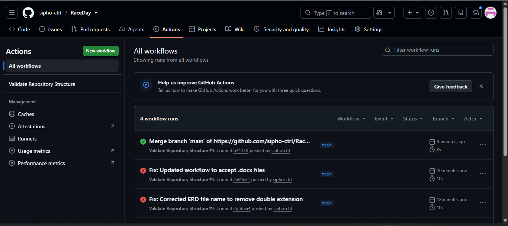

# RaceDay - Event Management System

## Student Information
- **Name**: Sipho Swartbooi
- **Student Number**: ST10467895
- **Assignment**: Part 1 - System Planning and Database

## System Overview
RaceDay is a full-stack web-based event management system designed specifically for the South African road running, walking, and cycling community. The platform allows Event Organisers to create and manage events, categories, and participant results, while Participants can browse upcoming events, enter events, track their personal performance history, and prepare for race day.

## User Roles

### Organiser
- Create, edit, and delete events
- Manage event categories
- Capture participant results
- View all event enrolments
- Monitor participant registrations

### Participant
- Create an account and manage profile
- Browse upcoming events
- Enter events by selecting categories
- View personal enrolments
- Track personal results and performance history

## Technology Stack
- **Database**: SQL Server (SSMS)
- **Backend**: ASP.NET Core Web API (Part 2)
- **Frontend**: MVC (Part 3)
- **Version Control**: GitHub
- **CI/CD**: GitHub Actions

## Project Structure
RaceDay/
├── docs/
│ ├── ERD.pdf
│ ├── APIEndpointPlan.docx
│ ├── RaceDayDatabase.sql
│ ├── green-build.png
│ ├── RD DB OUTPUT I.png
│ └── RD DB OUPUT II.png
├── .github/
│ └── workflows/
│ └── validate.yml
└── README.md

## Database Setup Instructions
1. Open SQL Server Management Studio (SSMS)
2. Connect to your SQL Server instance
3. Open the `RaceDayDatabase.sql` script from the `/docs` folder
4. Execute the script (press F5)
5. Verify all tables are created successfully
6. Check sample data is inserted (run the verification queries at the end)

### Database Output Verification
The following screenshots show the successful execution of the database script:

**Database Output 1:**

**Database Output 2:**

## CI/CD Status

## Video Presentation
[Watch the presentation on YouTube](TBA)
